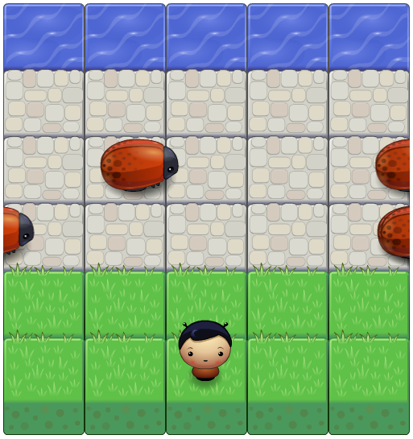

# Classic Arcade game

# How the game is played?
- Click [here](https://mosamy19.github.io/fend-arcade-game/) th start playing.
- Use keyboard arrows to move.

# Game dependencies
This is my solution for Udacity **Frontend Nanodegree** arcade game project.

I used Vanilla Javascript, ES2015 and OOP for building this game.

# Classic Arcade game
Check live demo [Here!](https://mosamy19.github.io/fend-arcade-game/).
